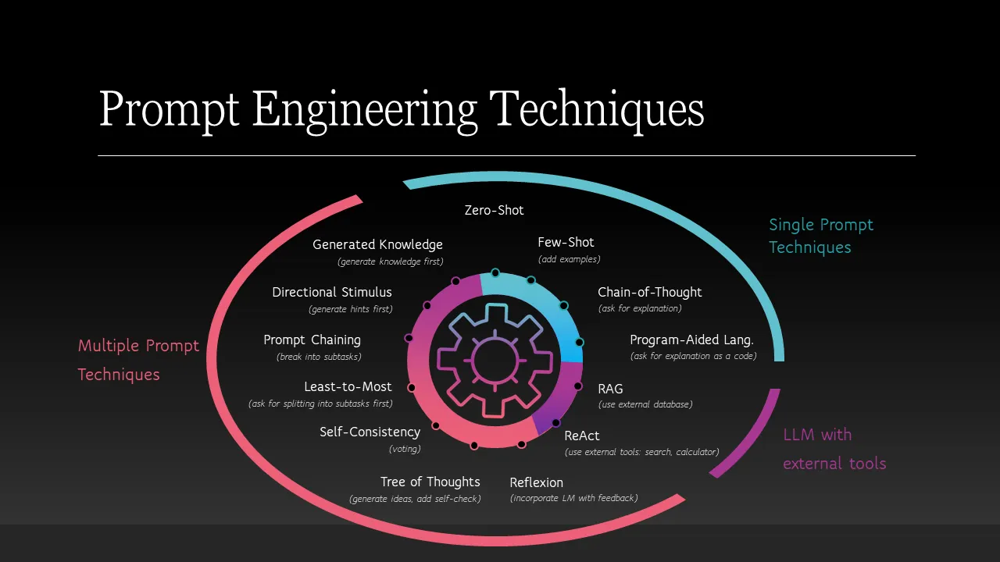

# Prompting Strategies for Large Language Models

# 1- Zero-shot 
Attempting to accomplish a task without providing any examples or context. The model is expected to generate a response based solely on the input prompt. They are useful when you want to test the model's general knowledge or when you have a clear and specific task in mind. However, they may not always produce accurate or relevant results, especially for complex tasks.

# 2- Few-shot
Attempting to provide feedback and examples to the model in the prompt. The model is expected to learn from the provided examples and generate a response based on that context. They are useful when you want to provide the model with some guidance or when you have a task that requires some level of understanding or reasoning. However, they may not always produce accurate or relevant results, especially if the examples are not representative of the task.

# 3- Chain-of-thought (CoT)
Asking the AI to to reason and iterate through a problem step-by-step, rather than providing a single answer. This can help the model to generate more accurate and relevant responses, especially for complex tasks that require reasoning or problem-solving. However, it may also increase the time and resources required to generate a response. One challenge with this approach is that the model may not always follow the intended reasoning path, and eventually lose the context, which may generate irrelevant or incorrect responses. To avoid this, open a new chat early if you notice the model is losing context or generating irrelevant responses.

# 4- Self-consistency
Using the same chain-of-thought prompt multiple times to generate multiple responses, and then selecting the most consistent or common response as the final answer. This can help to reduce the impact of any errors or inconsistencies in the model's reasoning, and increase the overall accuracy and reliability of the generated responses. However, it may also increase the time and resources required to generate a response, especially if you need to generate a large number of responses to achieve self-consistency. Again, like the CoT, this approach can alos sometimes lead to the model losing context in longer conversations. 

# 5- Prompt chaining
Breaking down a complex task into smaller sub-tasks, and using the output of one prompt as the input for the next prompt. This can help to simplify the task and make it easier for the model to generate accurate and relevant responses. Since the LLM operates on probabilistic reasoning, this approaach can also be ineffcetive sometimes. 

There are many other prompting strategies that can be used to improve the performance of large language models. However, for any strategy to be effective, it is important to use the clear language and be specific in you prompts. Additional, always name the file/docuemnt, or a concept you are working on. Providing the reasoning and justification of your task can also be helpful to the model in generating accurate and relevant responses. 

# Reference:
Ruksha, K. (2024, April 12). Prompt engineering: Classification of techniques and prompt tuning. Medium. https://medium.com/the-modern-scientist/prompt-engineering-classification-of-techniques-and-prompt-tuning-6d4247b9b64c

