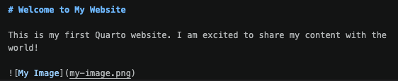
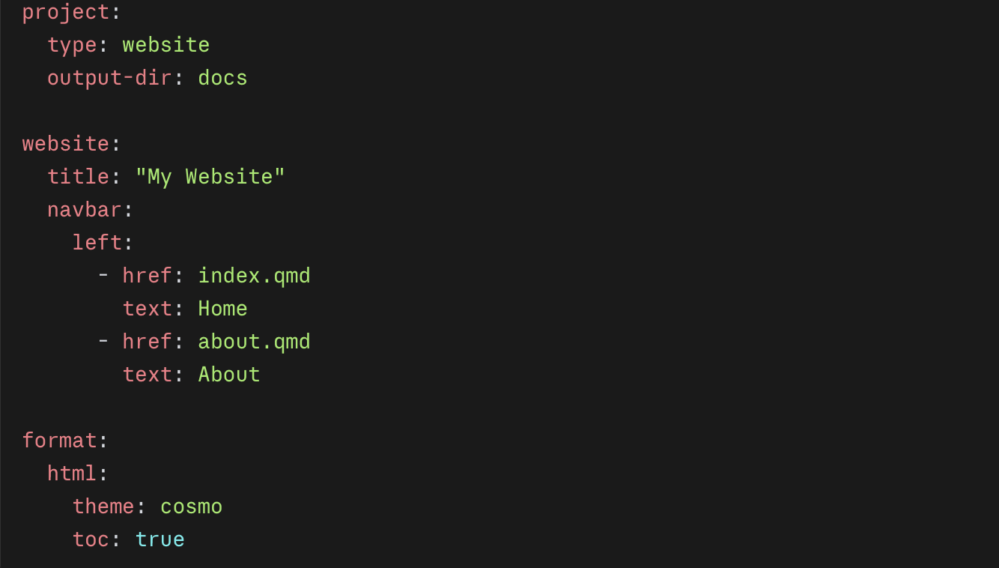

# How to create a Quarto website using GitHub and Markdown

Before strating, make sure your have intsall these tools,
 1- VS Code: Download it from code.visualstudio.com.
2- Git: Download it from git-scm.com. This lets VS Code send your files to GitHub.
3- Quarto: Download it from quarto.org (click Get Started).
4- Quarto extension for VS Code: Open VS Code, click the Extensions icon in the left sidebar (it looks like four squares), search for Quarto, and click Install.

Step 1: Create a GitHub repository

+ Sign in to your GitHub account and create a new repository. Give it a name and choose whether you want it to be public or private. You can also add a description and add a README file.
  
Step 2: Publish your repository

+ Click on the "Settings" tab of your repository, then click on "Pages" in the left sidebar. Under "Source", select the branch you want to use for your website (usually main) and click "Save". Your website will be published at https://your-username.github.io/your-repository-name.

Step 3: Create index.qmd file

+ Open the repository in VS Code and create a new file called index.qmd. This will be the main page of your website. You can add text, images, and other content using Markdown syntax. For example, you can add a title, a paragraph, and an image like this:
  

Step 4: Create Quarto file

+ create new file and name it "_quarto.yml"
+ Type these lines:

Save the files everytime you makes changes. [if you are using Mac  "Comd+S" and "Ctrl+S" if you are using Windows]
  
Step 5: Create additional pages

+ Create addition pages by creating new .qmd files in the repository. For example, you can create a file called about.qmd for an About page, or contact.qmd for a Contact page. You can link to these pages from your index.qmd file using Markdown links like this:
[About](about.qmd)

Step 6: Commit changes and Push
+ Open GitHub and write summary, commit changes and push. 
+ In VS Code, using the Terminal, type 'quarto render' to render the website. This will generate HTML files from your .qmd files and save them in a _site folder. You can preview your website locally by opening the index.html file in a web browser.

